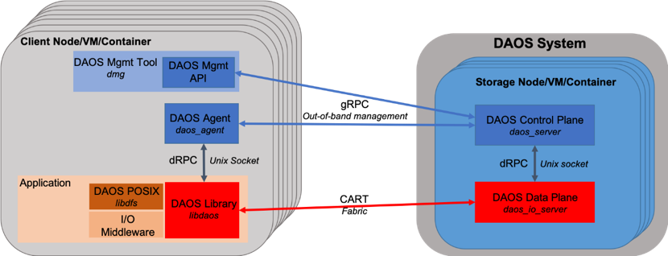

# DAOS 通信

DAOS的通信有三种：

- 用于管理的带外（out-of-band）TCP/IP网络——gRPC
- 用于数据访问的高性能fabric——CART
- 本地通信——Unix域套接字（基于套接字实现的dRPC）

可见，DAOS使用的通信协议有三种：

- gRPC
- dRPC
- CART (Collective and RPC Transport)

## 1. gRPC and Protocol Buffers

gRPC 为 DAOS 管理提供了双向安全通道。它依靠 TLS/SSL 对管理员角色和服务器进行身份验证。Protocol buffers 用于 RPC 序列化，所有proto文件都位于[proto](/src/proto)目录中。

主要的用途：依靠 TLS/SSL 对管理员角色和服务器进行身份验证

使用的领域：

- DAOS 管理 API(DAOS Mgmt API) 与 DAOS 控制平面之间的通信，以管理系统。
- DAOS 代理 与 DAOS 控制平面之间的通信，以实现身份验证功能。（DAOS代理通过gRPC与服务器的控制层通信，向客户端提供系统成员的信息。）

## 2. dRPC

dRPC 是通过 Unix 域套接字构建的通信通道，用于进程间通信。它同时提供 C 和 Go 接口，以支持（使用领域）：

- daos_agent 和 libdaos 用于应用程序（客户端）验证
- daos_server（控制平面）和daos_engine（数据平面）守护进程之间类似于 gRPC，RPC 通过protocol buffers进行序列化。

## 3. CART

[CART(Collective and RPC Transport)](https://github.com/daos-stack/cart) 是一个用户空间函数扩展库（也是一种RPC），为 **DAOS 数据平面**提供低延迟高带宽通信。**它支持 RDMA 功能和可扩展的集体操作**。CART 建在 [Mercury](https://github.com/mercury-hpc/mercury) 和 [libfabric](https://ofiwg.github.io/libfabric/) 之上。

- CART 库用于 `libdaos` 和 `daos_engine` 实例之间的所有通信。（主要是数据访问）